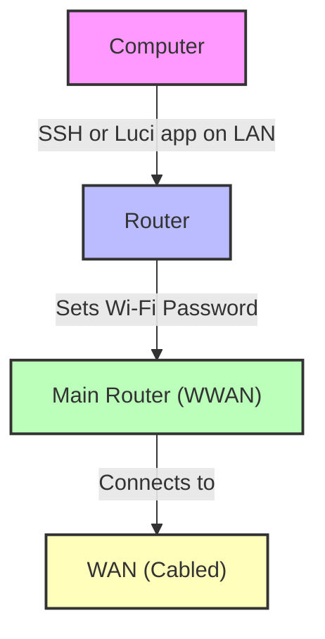

# raspberry pi 4 wifi router

this is a guide to set up a raspberry pi 4 as a wifi router.


download the latest version of openwrt from [here](https://downloads.openwrt.org/releases/23.05.0/targets/armvirt/64/openwrt-23.05.0-armvirt-64-default-rootfs.tar.gz)

on mac use belina to flash the image to the sd card which can be found [here](https://www.balena.io/etcher/)

use a sub to ethernet cable to connect the pi to the internet. For exmple this can be 

 openwrt image builder [here](https://firmware-selector.openwrt.org/?version=23.05.5&target=bcm27xx%2Fbcm2711&id=rpi-4)

 and commant to add to build is here

 #clone this repo on build and dhcp and network config in /etc/config/

 #run the build script

 #copy the image to the sd card

 #boot the pi and connect to the wifi network


after shelling in run on any packges that have not been specified in the open-wrt-build. eg an ethernet cable to usb driver for TP-Link UE300 USB 3.0 to Gigabit Ethernet Adapter.

```bash
opkg update
opkg install kmod-usb-net-cdc-ether
```

## diagram of setup in this repo
## **Using Mermaid**



## NanoPi R5C Mini Router [here](https://wiki.friendlyelec.com/wiki/index.php/NanoPi_R5C#Install_OS_to_eMMC)

Openwrt page [here](https://openwrt.org/toh/friendlyarm/nanopi_r5c)


step to manually install usb driver for the usb ethernet adapter 

```bash
opkg update
opkg install kmod-usb-net-rtl8152
```

check if the driver is installed (the drive here is also added to the open-wrt-requirments.txt file for installation on image build)

```bash
lsmod | grep 8152
```

after install check the driver is working by running

```bash
ifconfig
```

output that you are looking for should be something like this (eth0 is the ehternet 
cable and eth1 is the usb ethernet adapter)

```bash
eth0      Link encap:Ethernet  [...]
eth1      Link encap:Ethernet  [...]
    

```

then add the following to the /etc/config/network file:

```bash
## To Do

- [ ] step by step video recording
- [ ] deploy on neopi5 mini router
- [ ] make a reboot/ on boot reset option
- [x] update scirpt to set all settings when making the image
- [ ] step by step process for R5C mini router
- [ ] setup ssh with auth keys rather than password
    
- 

random ideas for future

- use a small model to detect anomilies in network traffic.
- use an llm to summarise network traffic patterns.
- treat nework traffic as a spectrogram and use a small model to detect specific patterns.
- explore running code on openwrt/ an ml package for openwrt.
- a wireless qr that does not require travel mate as this repos share the configs that essential set up a travle rounter.
- use wifi signal processing to detect objects in real time and use this to augment computer vision.


## Interestion hardware:

[vocore v2up](https://vocore.io/v2up.html)

look how small it is!!!!
